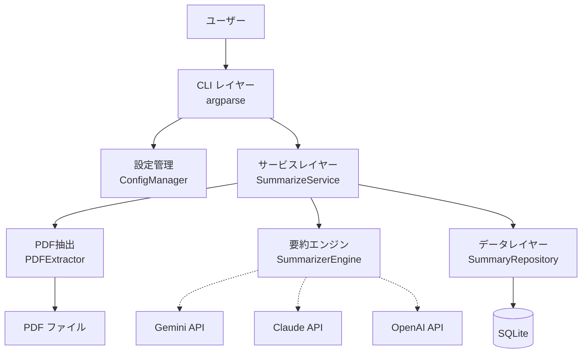
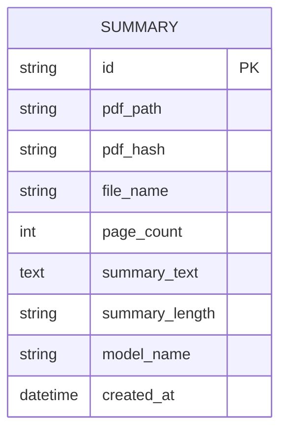
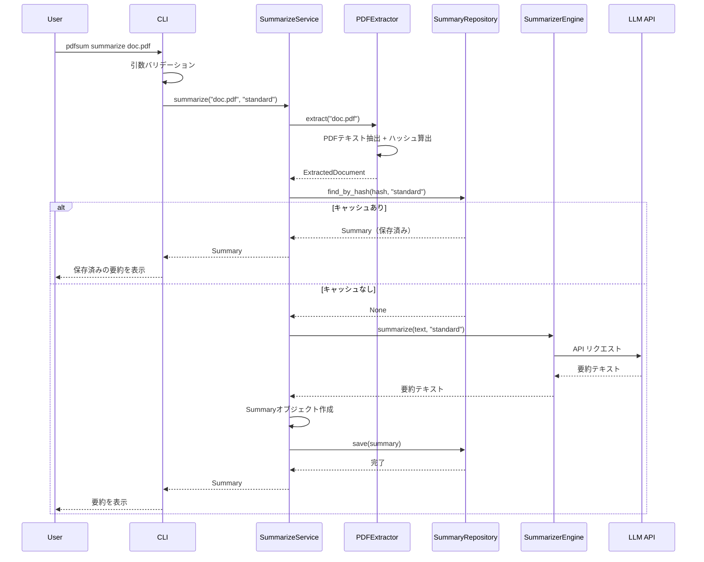
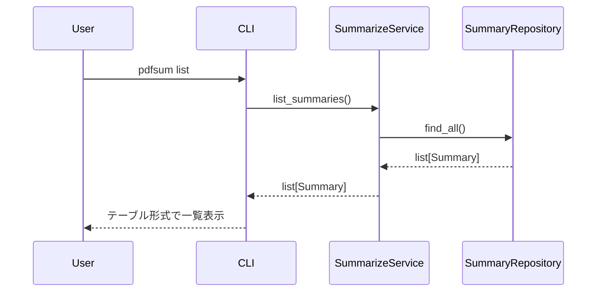
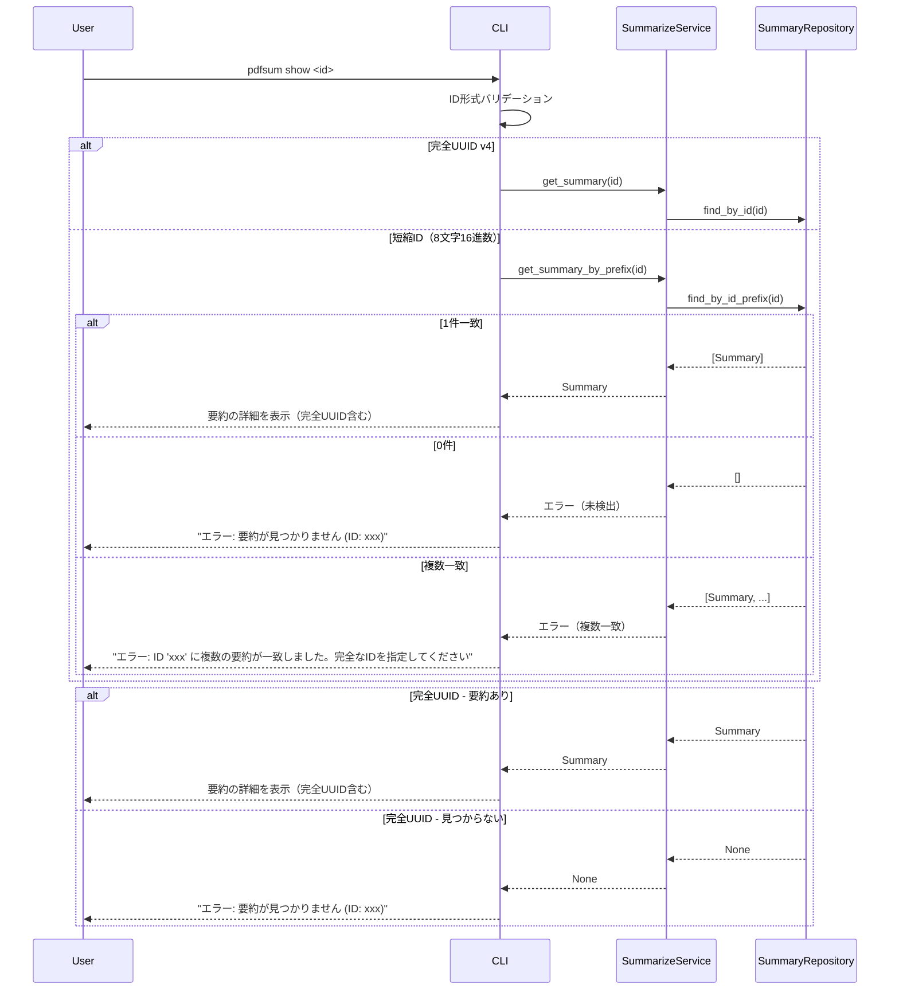
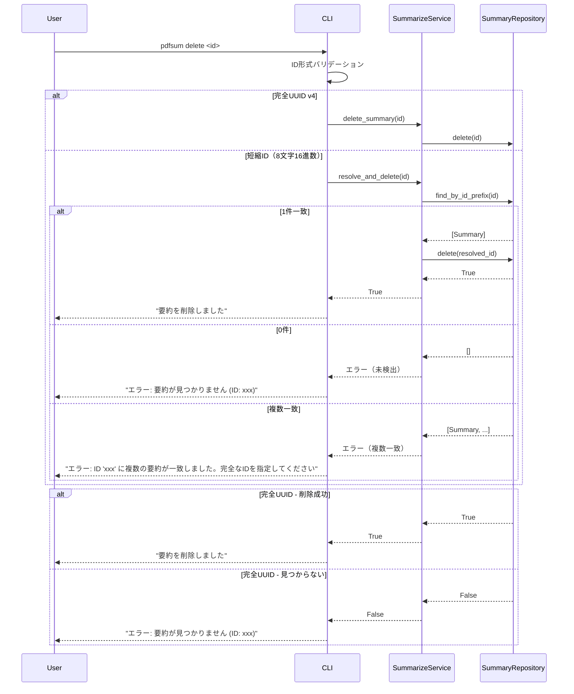
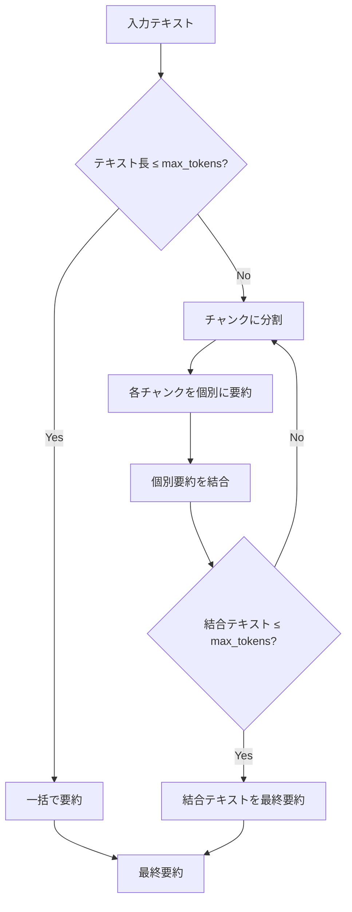

# 機能設計書 (Functional Design Document)

## システム構成図



## 技術スタック

| 分類 | 技術 | 選定理由 |
|------|------|----------|
| 言語 | Python 3.12+ | 初期要件で指定。豊富な標準ライブラリ |
| パッケージ管理 | uv | 初期要件で指定。高速な依存管理 |
| テスト | pytest | 初期要件で指定。Pythonの標準的なテストフレームワーク |
| DB | SQLite (sqlite3) | 標準ライブラリに含まれる。ローカル完結 |
| PDF解析 | pymupdf (PyMuPDF) | 高速・高精度なPDFテキスト抽出。日本語対応 |
| CLI | argparse | 標準ライブラリ。外部依存不要 |
| LLM API通信 | httpx | 非同期対応の軽量HTTPクライアント |
| 設定管理 | tomllib (標準) + tomli-w | TOML形式。読み込みは標準ライブラリ |

## データモデル定義

### エンティティ: Summary（要約結果）

```python
@dataclass
class Summary:
    id: str                    # UUID v4
    pdf_path: str              # 元PDFの絶対パス
    pdf_hash: str              # PDFファイルのSHA-256ハッシュ
    file_name: str             # PDFファイル名
    page_count: int            # PDFの総ページ数
    summary_text: str          # 要約テキスト
    summary_length: str        # 要約の長さ ("short" | "standard" | "detailed")
    model_name: str            # 使用したLLMモデル名
    created_at: datetime       # 作成日時
```

**制約**:
- `pdf_hash` は SHA-256（64文字の16進数文字列）
- `summary_length` は `"short"`, `"standard"`, `"detailed"` のいずれか
- `id` は UUID v4 形式

### エンティティ: ExtractedPage（抽出ページ）

```python
@dataclass
class ExtractedPage:
    page_number: int           # ページ番号（1始まり）
    text: str                  # 抽出されたテキスト
```

### エンティティ: ExtractedDocument（抽出結果）

```python
@dataclass
class ExtractedDocument:
    file_name: str             # ファイル名
    pdf_path: str              # ファイルパス
    pdf_hash: str              # SHA-256ハッシュ
    page_count: int            # 総ページ数
    pages: list[ExtractedPage] # ページごとの抽出結果
    total_text: str            # 全ページ結合テキスト
```

### エンティティ: Config（アプリケーション設定）

```python
@dataclass
class ProviderConfig:
    api_key_env: str           # APIキーの環境変数名

@dataclass
class LLMConfig:
    provider: str              # "gemini" | "claude" | "openai"
    model: str                 # モデル名
    providers: dict[str, ProviderConfig]  # プロバイダ別設定

@dataclass
class SummaryConfig:
    default_length: str        # デフォルトの要約長 ("short" | "standard" | "detailed")

@dataclass
class DatabaseConfig:
    path: str                  # データベースファイルのパス

@dataclass
class Config:
    llm: LLMConfig             # [llm] セクションに対応
    summary: SummaryConfig     # [summary] セクションに対応
    database: DatabaseConfig   # [database] セクションに対応
```

**制約**:
- `llm.provider` は `"gemini"`, `"claude"`, `"openai"` のいずれか
- `summary.default_length` は `"short"`, `"standard"`, `"detailed"` のいずれか
- `llm.providers` は設定ファイルの `[llm.gemini]`, `[llm.claude]`, `[llm.openai]` セクションに対応

**TOML設定ファイルとの対応**:
| データモデル | TOMLセクション |
|---|---|
| `Config.llm` | `[llm]` |
| `Config.llm.providers["gemini"]` | `[llm.gemini]` |
| `Config.llm.providers["claude"]` | `[llm.claude]` |
| `Config.llm.providers["openai"]` | `[llm.openai]` |
| `Config.summary` | `[summary]` |
| `Config.database` | `[database]` |

**配置先**: `src/pdfsum/config/manager.py` 内に定義（設定管理の責務に含まれるため）

### ER図



## ライブラリAPI

### `create_service()` ファクトリ関数

`pip install pdfsum`後にPythonコードからも利用できる公開APIを提供する。

**シグネチャ**:
```python
def create_service(
    provider: str | None = None,
    api_key: str | None = None,
    *,
    model: str | None = None,
    db_path: str | None = None,
    extra_instructions: str | None = None,
) -> SummarizeService:
```

**パラメータ**:

| パラメータ | 型 | デフォルト | 説明 |
|-----------|------|-----------|------|
| `provider` | `str \| None` | `None` | LLMプロバイダ名 ("gemini", "claude", "openai")。未指定時はconfig.tomlから取得 |
| `api_key` | `str \| None` | `None` | APIキー。未指定時は環境変数から取得 |
| `model` | `str \| None` | `None` | モデル名。未指定時はプロバイダのデフォルトモデル |
| `db_path` | `str \| None` | `None` | データベースファイルのパス。未指定時は `~/.local/share/pdfsum/summaries.db` |
| `extra_instructions` | `str \| None` | `None` | 要約プロンプトへの追加指示 |

**戻り値**: `SummarizeService` — 要約サービスのインスタンス

**例外**: `ConfigError` — 設定の読み込みやAPIキーの取得に失敗した場合

**config.toml連携**:
- `provider`引数が未指定の場合、`ConfigManager.load()`でconfig.tomlから設定を読み込む
- config.tomlが存在しない場合はデフォルト設定（provider="gemini"）が使用される
- `provider`引数を指定した場合はconfig.toml不要で、引数と環境変数のみで構築する

**プロバイダ別デフォルトモデル**:

| プロバイダ | デフォルトモデル |
|-----------|----------------|
| gemini | gemini-2.5-flash |
| claude | claude-sonnet-4-20250514 |
| openai | gpt-4o |

**解決ロジック**:
1. `provider`未指定 → ConfigManager.load()でconfig.tomlから取得
2. `provider`指定あり、`api_key`未指定 → 環境変数フォールバック
3. `provider`指定あり、`api_key`指定あり → そのまま使用
4. `model`未指定 → DEFAULT_MODELS[provider]
5. `db_path`未指定 → DEFAULT_DB_PATH

## コンポーネント設計

### CLI レイヤー

**責務**:
- コマンドライン引数の解析とバリデーション
- サービス層の呼び出し
- 結果・エラーの表示
- プログレス表示

**インターフェース**:
```python
class CLI:
    def run(self, args: list[str] | None = None) -> int:
        """メインエントリポイント。終了コードを返す"""
        ...

    def cmd_summarize(self, pdf_path: str, length: str) -> None:
        """PDF要約コマンド"""
        ...

    def cmd_list(self, full_id: bool = False) -> None:
        """保存済み要約一覧コマンド。full_id=True で完全UUID表示"""
        ...

    def cmd_show(self, summary_id: str) -> None:
        """保存済み要約表示コマンド"""
        ...

    def cmd_delete(self, summary_id: str) -> None:
        """保存済み要約削除コマンド"""
        ...
```

**バージョン表示**: argparse の `parser.add_argument("--version", action="version")` を使用してバージョン情報を表示する。バージョン番号は `pyproject.toml` の `[project].version` から取得する。

### 設定管理 (ConfigManager)

**責務**:
- 設定ファイル（TOML）の読み込み（MVP段階では読み込みのみ。書き込み機能は将来的に `pdfsum config set` コマンド等で提供予定）
- LLM APIキーの管理（環境変数優先）
- デフォルト設定の提供

**設定ファイル**: `~/.config/pdfsum/config.toml`

```toml
[llm]
provider = "gemini"           # "gemini" | "claude" | "openai"
model = "gemini-2.5-flash"    # モデル名

[llm.gemini]
api_key_env = "GEMINI_API_KEY"  # 環境変数名

[llm.claude]
api_key_env = "ANTHROPIC_API_KEY"

[llm.openai]
api_key_env = "OPENAI_API_KEY"

[summary]
default_length = "standard"   # "short" | "standard" | "detailed"

[database]
path = "~/.local/share/pdfsum/summaries.db"
```

**インターフェース**:
```python
class ConfigManager:
    def load(self) -> Config:
        """設定を読み込む。ファイルがなければデフォルト設定を返す"""
        ...

    def get_api_key(self, provider: str) -> str:
        """指定プロバイダのAPIキーを環境変数から取得"""
        ...
```

### PDF抽出 (PDFExtractor)

**責務**:
- PDFファイルからテキストを抽出
- ページ単位でのテキスト管理
- PDFファイルのハッシュ値算出

**インターフェース**:
```python
class PDFExtractor:
    def extract(self, pdf_path: str) -> ExtractedDocument:
        """PDFからテキストを抽出する"""
        ...

    def calculate_hash(self, pdf_path: str) -> str:
        """PDFファイルのSHA-256ハッシュを算出する"""
        ...
```

**依存関係**:
- pymupdf (PyMuPDF)
- hashlib（標準ライブラリ）

### 要約エンジン (SummarizerEngine) - Strategy パターン

**責務**:
- テキストの要約生成
- LLM APIとの通信
- チャンク分割と段階的要約

**インターフェース（抽象基底クラス）**:
```python
from abc import ABC, abstractmethod

class SummarizerEngine(ABC):
    @abstractmethod
    def summarize(self, text: str, length: str) -> str:
        """テキストを要約する"""
        ...

    @abstractmethod
    def get_model_name(self) -> str:
        """使用モデル名を返す"""
        ...

    @abstractmethod
    def get_max_input_tokens(self) -> int:
        """最大入力トークン数を返す"""
        ...
```

**具象クラス**:
```python
class GeminiSummarizer(SummarizerEngine):
    """Google Gemini APIを使用した要約エンジン"""
    ...

class ClaudeSummarizer(SummarizerEngine):
    """Anthropic Claude APIを使用した要約エンジン"""
    ...

class OpenAISummarizer(SummarizerEngine):
    """OpenAI APIを使用した要約エンジン"""
    ...
```

**ファクトリ**:
```python
class SummarizerFactory:
    @staticmethod
    def create(provider: str, api_key: str, model: str) -> SummarizerEngine:
        """設定に基づいて適切な要約エンジンを生成する"""
        ...
```

### データレイヤー (SummaryRepository) - Repository パターン

**責務**:
- 要約結果の永続化
- 要約結果の検索・取得・削除

**インターフェース（抽象基底クラス）**:
```python
from abc import ABC, abstractmethod

class SummaryRepository(ABC):
    @abstractmethod
    def save(self, summary: Summary) -> None:
        """要約を保存する"""
        ...

    @abstractmethod
    def find_by_id(self, summary_id: str) -> Summary | None:
        """完全なIDで要約を取得する"""
        ...

    @abstractmethod
    def find_by_id_prefix(self, id_prefix: str) -> list[Summary]:
        """IDの前方一致で要約を検索する（短縮ID解決用）"""
        ...

    @abstractmethod
    def find_by_hash(self, pdf_hash: str, summary_length: str) -> Summary | None:
        """PDFハッシュと要約長で要約を検索する"""
        ...

    @abstractmethod
    def find_all(self) -> list[Summary]:
        """全要約を取得する"""
        ...

    @abstractmethod
    def delete(self, summary_id: str) -> bool:
        """要約を削除する。成功時True"""
        ...
```

**具象クラス**:
```python
class SQLiteSummaryRepository(SummaryRepository):
    """SQLiteを使用したRepository実装"""

    def __init__(self, db_path: str):
        ...
```

### サービスレイヤー (SummarizeService)

**責務**:
- ユースケースの統合（抽出 → キャッシュ確認 → 要約 → 保存）
- ビジネスロジックの制御

**インターフェース**:
```python
class SummarizeService:
    def __init__(
        self,
        extractor: PDFExtractor,
        engine: SummarizerEngine,
        repository: SummaryRepository,
    ):
        ...

    def summarize(self, pdf_path: str, length: str) -> Summary:
        """PDFを要約する。キャッシュがあればそれを返す"""
        ...

    def list_summaries(self) -> list[Summary]:
        """保存済み要約の一覧を返す"""
        ...

    def get_summary(self, summary_id: str) -> Summary | None:
        """完全なIDで要約を取得する"""
        ...

    def get_summary_by_prefix(self, id_prefix: str) -> Summary:
        """短縮IDから要約を取得する。0件時は要約ID未検出エラー、複数一致時は複数一致エラー"""
        ...

    def delete_summary(self, summary_id: str) -> bool:
        """完全なIDで要約を削除する"""
        ...

    def resolve_and_delete(self, id_prefix: str) -> bool:
        """短縮IDから要約を解決して削除する。0件時は要約ID未検出エラー、複数一致時は複数一致エラー"""
        ...
```

## ユースケース図

### UC1: PDF要約（`pdfsum summarize`）



**フロー説明**:
1. ユーザーがPDFパスを指定してコマンドを実行
2. CLIが引数をバリデーション（ファイル存在確認、拡張子確認）
3. PDFExtractorがテキスト抽出とハッシュ算出を実行
4. Repositoryでキャッシュを確認（同一ハッシュ + 同一要約長）
5. キャッシュがあればそのまま返却、なければLLM APIで要約生成
6. 生成した要約をDBに保存し、結果をユーザーに表示

### UC2: 保存済み要約一覧（`pdfsum list`）



### UC3: 保存済み要約表示（`pdfsum show`）



### UC4: 保存済み要約削除（`pdfsum delete`）



## アルゴリズム設計

### チャンク分割要約アルゴリズム

**目的**: コンテキストウィンドウを超えるテキストを段階的に要約する

**処理フロー**:



**ステップ1: トークン数推定**
- 日本語: 1文字 ≈ 1.5トークン
- 英語: 1単語 ≈ 1.3トークン
- 安全マージンとして最大入力トークンの80%をチャンクサイズの上限とする

**ステップ2: チャンク分割**
- ページ境界でチャンクを分割（文の途中で切らない）
- 各チャンクがmax_tokensの80%以内に収まるよう調整

**ステップ3: 段階的要約**
- 各チャンクを個別に要約
- 個別要約を結合し、最終要約を生成
- 結合しても制限を超える場合は再帰的に処理

**実装例**:
```python
class ChunkedSummarizer:
    def __init__(self, engine: SummarizerEngine):
        self.engine = engine

    def summarize(self, text: str, length: str) -> str:
        max_tokens = int(self.engine.get_max_input_tokens() * 0.8)
        estimated_tokens = self._estimate_tokens(text)

        if estimated_tokens <= max_tokens:
            return self.engine.summarize(text, length)

        chunks = self._split_into_chunks(text, max_tokens)
        chunk_summaries = [
            self.engine.summarize(chunk, "standard")
            for chunk in chunks
        ]
        combined = "\n\n".join(chunk_summaries)
        return self.summarize(combined, length)  # 再帰

    def _estimate_tokens(self, text: str) -> int:
        ...

    def _split_into_chunks(self, text: str, max_tokens: int) -> list[str]:
        ...
```

### 要約プロンプト設計

**要約長ごとのプロンプト指示**:

| 要約長 | 指示 | 目標文字数 |
|--------|------|-----------|
| short | 要点のみを箇条書きで | 300-500文字 |
| standard | 要点と重要な詳細を含めて | 1000-2000文字 |
| detailed | 章ごとの概要と要点を | 3000-5000文字 |

## CLI出力設計

### 要約結果の表示

```
📄 doc.pdf (42ページ)
━━━━━━━━━━━━━━━━━━━━━━━━━━━━━━━━━━━━━━━━

[要約テキスト]

━━━━━━━━━━━━━━━━━━━━━━━━━━━━━━━━━━━━━━━━
モデル: gemini-2.5-flash | 要約ID: a1b2c3d4-e5f6-4a8b-9c0d-e1f2a3b4c5d6
```

> **注記**: `pdfsum summarize` の出力では完全なUUID v4を表示する。`pdfsum list` では短縮ID（先頭8文字）を表示し、`pdfsum list --full-id` で完全UUIDを表示する。

### 一覧表示（`pdfsum list`）

IDはUUID v4の先頭8文字を短縮表示する。`pdfsum show` / `pdfsum delete` では短縮IDまたは完全なUUIDのどちらでも指定可能とする。短縮IDが複数一致した場合は、`pdfsum list --full-id` で完全なUUID v4を一覧表示して確認できる。

**短縮IDの仕様**:
- 一覧表示ではUUID v4の先頭8文字を短縮IDとして表示する
- `pdfsum show` / `pdfsum delete` では完全なUUID v4（36文字）または短縮ID（先頭8文字の16進数文字列）を受け付ける
- 入力が完全なUUID v4形式でも8文字の16進数文字列でもない場合: `エラー: 無効なID形式です: {id}（UUID v4または先頭8文字の16進数を指定してください）` と表示し処理を中断する

**短縮IDの解決アルゴリズム**（SQLインジェクション対策としてパラメータバインドを使用）:
- 完全なUUID v4が入力された場合: `WHERE id = ?` の完全一致検索を行う
- 短縮ID（8文字）が入力された場合: `WHERE id LIKE ? || '%'` の前方一致検索を行う
- 一意に特定できた場合: そのレコードを対象とする
- 複数件一致した場合: `エラー: ID '{id}' に複数の要約が一致しました。完全なIDを指定してください` と表示し処理を中断する
- 0件の場合: `エラー: 要約が見つかりません (ID: {id})` と表示し処理を中断する

```
ID        ファイル名                 ページ  長さ      作成日時
────────  ────────────────────────  ──────  ────────  ──────────────────
a1b2c3d4  report-2026-q1.pdf          42    standard  2026-02-28 10:30
e5f6a7b8  specification-v2.pdf       128    detailed  2026-02-27 14:15
c9d0e1f2  meeting-notes.pdf            8    short     2026-02-26 09:00
```

### プログレス表示

```
[1/3] PDFテキスト抽出中... 完了 (42ページ)
[2/3] テキスト要約中... 完了
[3/3] 結果を保存中... 完了
```

## ファイル構造

### データ保存

```
~/.local/share/pdfsum/
└── summaries.db    # SQLiteデータベース
```

### 設定ファイル

```
~/.config/pdfsum/
└── config.toml     # アプリケーション設定
```

### SQLiteスキーマ

```sql
CREATE TABLE IF NOT EXISTS summaries (
    id TEXT PRIMARY KEY,
    pdf_path TEXT NOT NULL,
    pdf_hash TEXT NOT NULL,
    file_name TEXT NOT NULL,
    page_count INTEGER NOT NULL,
    summary_text TEXT NOT NULL,
    summary_length TEXT NOT NULL CHECK(summary_length IN ('short', 'standard', 'detailed')),
    model_name TEXT NOT NULL,
    created_at TEXT NOT NULL
);

CREATE INDEX IF NOT EXISTS idx_summaries_pdf_hash ON summaries(pdf_hash, summary_length);

-- DB初期化時にWALモードを有効化（書き込み中のクラッシュによるDB破損を防止）
PRAGMA journal_mode=WAL;
```

## パフォーマンス最適化

- **キャッシュ**: 同一PDFハッシュ+要約長の組み合わせでDB検索し、再処理を回避
- **ハッシュ算出**: ファイルをチャンク単位で読み込み、メモリ使用量を抑制
- **チャンク分割**: ページ境界で分割し、意味的な区切りを維持

## セキュリティ考慮事項

- **APIキー管理**: 環境変数から取得。設定ファイルにAPIキーを直接記述しない。`api_key_env` フィールドで環境変数名のみ保持
- **PDF送信の明示**: LLM API利用時、初回実行で「PDFの内容が外部APIに送信されます」と送信先APIエンドポイントを表示し、ユーザーの確認を求める
- **設定ファイル権限**: 作成時に`chmod 600`で所有者のみ読み書き可能に設定
- **DBファイル権限**: 作成時に`chmod 600`で所有者のみ読み書き可能に設定
- **入力バリデーション**: PDFパスのパストラバーサル防止（シンボリックリンク解決後の実パスを使用）

## エラーハンドリング

### エラーの分類

| エラー種別 | 処理 | ユーザーへの表示 |
|-----------|------|-----------------|
| ファイル未検出 | 処理中断 | `エラー: ファイルが見つかりません: {path}` |
| PDF以外のファイル | 処理中断 | `エラー: PDF以外のファイルです: {extension}` |
| PDF解析失敗 | 処理中断 | `エラー: PDFの読み取りに失敗しました。ファイルが破損しているか、パスワード保護されている可能性があります` |
| APIキー未設定 | 処理中断 | `エラー: APIキーが設定されていません。環境変数 {env_var} を設定してください` |
| API通信エラー | 処理中断 | `エラー: LLM APIとの通信に失敗しました: {details}` |
| APIレート制限 | リトライ（最大3回、指数バックオフ） | `警告: APIレート制限に達しました。{n}秒後にリトライします...` |
| DB書き込みエラー | 要約は表示するが保存失敗を通知 | `警告: 要約結果の保存に失敗しました。要約自体は正常に生成されています` |
| 要約ID未検出 | 処理中断 | `エラー: 要約が見つかりません (ID: {id})` |
| テキスト抽出ゼロ | 処理中断 | `エラー: PDFからテキストを抽出できませんでした。画像のみのPDFの可能性があります` |
| 要約ID形式不正 | 処理中断 | `エラー: 無効なID形式です: {id}（UUID v4または先頭8文字の16進数を指定してください）` |
| 短縮ID複数一致 | 処理中断 | `エラー: ID '{id}' に複数の要約が一致しました。完全なIDを指定してください` |

### 終了コード

| コード | 意味 |
|--------|------|
| 0 | 正常終了 |
| 1 | 一般的なエラー |
| 2 | 引数エラー（argparse デフォルト） |

## テスト戦略

### ユニットテスト
- `PDFExtractor`: テスト用PDF（fixture）を使ったテキスト抽出テスト
- `SummarizerEngine`: モック API レスポンスを使った要約テスト
- `SQLiteSummaryRepository`: インメモリSQLiteを使ったCRUDテスト
- `SummarizeService`: 各コンポーネントをモックしたサービスロジックテスト
- `ConfigManager`: 設定ファイル読み込み・デフォルト値テスト
- `ChunkedSummarizer`: チャンク分割ロジックのテスト

### 統合テスト
- PDF → テキスト抽出 → 要約 → 保存 のエンドツーエンドフロー（モックLLM API使用）
- キャッシュヒット時のフロー検証
- 設定ファイルなし（デフォルト設定）での動作検証

### E2Eテスト
- CLI コマンドの実行と出力の検証（`subprocess`で実行）
- `pdfsum summarize` → `pdfsum list` → `pdfsum show` → `pdfsum delete` の一連の操作
